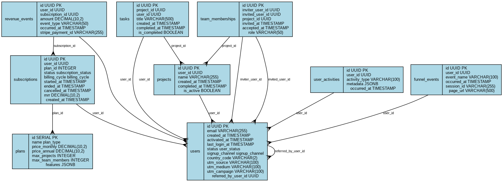

# SaaS Analytics with PostgreSQL

A self-contained, Docker-ready PostgreSQL analytics demo built around a realistic SaaS project-management app (Free / Basic / Premium plans). It ships with a complete relational schema, 1,000+ rows of realistic generated sample data, 50+ ready-to-run SQL queries, and an interactive Jupyter notebook with visualizations — everything needed to explore MRR, churn, conversion funnels, retention, and growth-channel performance with a single command.

## Features

- **One-command setup** — `docker compose up` spins up PostgreSQL, an interactive Jupyter notebook, and (optionally) pgAdmin
- **Realistic relational schema** covering users, plans, subscriptions, projects, tasks, team memberships, revenue events, user activities, and funnel events
- **Generated sample data**: 1,000 users, 1,000+ subscriptions, ~1,900 projects, ~10,700 tasks, 500 team memberships, and 600+ revenue events spanning 12 months
- **50+ analytics queries** in `analytics_queries.sql` covering revenue, MRR/ARR, conversion, retention, churn, activation, engagement, channel performance, and a full growth-metrics dashboard
- **Interactive Jupyter notebook** (`notebooks/SaaS_Analytics_Demo.ipynb`) with Plotly/Matplotlib/Seaborn visualizations, pre-connected to the database
- **Entity-relationship diagram generator** (`generate_erd.py`) for visualizing the schema
- **Quick CLI dashboard** (`quick_dashboard.py`) for a fast, no-notebook snapshot of key metrics
- **Helper scripts** for native (non-Docker) PostgreSQL setup and project validation

## Schema Overview



| Table | Purpose |
|---|---|
| `users` | Core accounts: signup/activation timestamps, status, signup channel, UTM attribution, country, referrals |
| `plans` | Plan definitions: Free, Basic, Premium — pricing, limits, and feature flags (JSONB) |
| `subscriptions` | Subscription history: plan, billing cycle, status, MRR, start/end/cancellation dates |
| `projects` | Core product usage — one row per project a user creates |
| `tasks` | Task-level engagement within projects |
| `team_memberships` | Collaboration/invite tracking for viral growth analysis |
| `revenue_events` | Individual financial transactions (payment, refund, upgrade, downgrade) |
| `user_activities` | Generic behavioral event log (logins, project/task creation, invites, etc.) with JSONB metadata |
| `funnel_events` | Conversion funnel tracking: signup → email verified → onboarding → first project → payment → subscription |

The schema also includes two convenience views (`current_subscriptions`, `monthly_cohorts`) and a `calculate_mrr(date)` SQL function for point-in-time MRR calculations.

## Prerequisites

- Docker and Docker Compose (recommended path)
- *or*, for a native setup: PostgreSQL 15+, `psql`, and Python 3.9+

## Quick Start (Docker, recommended)

```bash
git clone <repo-url>
cd saas-analytics-postgres
docker compose up
```

This single command starts:
- PostgreSQL, pre-loaded with the schema and 1,000+ rows of 12-month sample data
- A Jupyter notebook server with all analytics libraries pre-installed

Once running (~30 seconds):

- **Jupyter Notebook**: open [http://localhost:8888](http://localhost:8888) and run `SaaS_Analytics_Demo.ipynb`
- **PostgreSQL**: `psql -h localhost -p 5432 -U saas_user -d saas_analytics_demo` (password: `demo_password`)
- **pgAdmin** (optional): `docker compose --profile pgadmin up`, then visit [http://localhost:8080](http://localhost:8080)

Stop everything with `docker compose down`, or `docker compose down -v` to also wipe the database volume.

## Native Setup (without Docker)

```bash
pip install -r requirements.txt
./setup_database.sh
```

The script checks for a running PostgreSQL instance, creates the database/user, applies `schema.sql`, loads `sample_data.sql`, verifies row counts, and (if Graphviz is installed) generates a schema diagram. Run `./setup_database.sh --reset` to drop and recreate the database from scratch.

## Repository Structure

```
.
├── docker-compose.yml          # Postgres + Jupyter (+ optional pgAdmin) services
├── Dockerfile                  # Jupyter image with analytics libraries
├── wait-for-postgres.sh        # Entrypoint helper: waits for DB before starting Jupyter
├── schema.sql                  # Full PostgreSQL schema: tables, types, indexes, views, functions
├── sample_data.sql             # Generates realistic 12-month sample dataset
├── analytics_queries.sql       # 50+ SQL queries answering key SaaS growth questions
├── key_questions.md            # The business questions this project is designed to answer
├── notebooks/
│   └── SaaS_Analytics_Demo.ipynb  # Interactive analysis & visualizations
├── generate_erd.py             # Generates an ERD from the live schema (requires Graphviz)
├── quick_dashboard.py          # CLI snapshot of key metrics (no notebook required)
├── setup_database.sh           # Native (non-Docker) database setup script
├── project_summary.sh          # Validates repo completeness and prints a project overview
├── readme_assets/
│   └── schema_diagram_readme.png
├── requirements.txt
├── .env.example
└── LICENSE
```

## Analytics Covered

The queries in `analytics_queries.sql` and the notebook answer questions such as:

- **Revenue**: sales volume per plan over various windows, MRR/ARR by plan, ARPU, LTV by plan
- **Conversion**: free-to-paid conversion rate, time-to-upgrade, conversion by signup channel
- **Retention & churn**: cohort retention curves, monthly churn rate by plan
- **Activation & engagement**: activation rate, feature usage depth (projects/tasks/team invites) by plan
- **Growth & channels**: full signup → activation → paid funnel with drop-off, channel and geographic performance
- **Operational snapshot**: a single "key metrics dashboard" query combining the above into one view

See `key_questions.md` for the full list of business questions this schema and query set is designed to support.

## Example Query

```sql
-- Current MRR by plan
SELECT
    p.name as plan,
    COUNT(s.id) as active_subscriptions,
    SUM(CASE
        WHEN s.billing_cycle = 'monthly' THEN s.mrr
        WHEN s.billing_cycle = 'annual' THEN s.mrr / 12
        ELSE s.mrr
    END) as monthly_recurring_revenue
FROM subscriptions s
JOIN plans p ON s.plan_id = p.id
WHERE s.status = 'active'
GROUP BY p.name
ORDER BY monthly_recurring_revenue DESC;
```

Run it via `psql`, or from Python/Jupyter with `pandas.read_sql(query, engine)` — the notebook is already connected to the database.

## Quick CLI Dashboard

For a fast metrics snapshot without opening Jupyter:

```bash
python quick_dashboard.py
```

Reads connection details from environment variables (`PGHOST`, `PGPORT`, `PGDATABASE`, `PGUSER`, `PGPASSWORD`), defaulting to the Docker Compose credentials.

## Generating the Schema Diagram

```bash
python generate_erd.py
```

Requires `psycopg2` (for live schema introspection) and Graphviz (for rendering). Outputs `schema_diagram.dot`/`.png`/`.svg`.

## Tech Stack

- **Database**: PostgreSQL 15 (UUIDs, ENUMs, JSONB, views, PL/pgSQL functions)
- **Analytics & Visualization**: Jupyter, pandas, NumPy, SQLAlchemy, psycopg2, Matplotlib, Seaborn, Plotly
- **Infrastructure**: Docker, Docker Compose, pgAdmin (optional)

## Using Your Own Data

This project is designed as a template: replace `sample_data.sql` with your own data loading logic (or an ETL pipeline) against the same schema, and every query in `analytics_queries.sql` plus the notebook will work against real production data.
